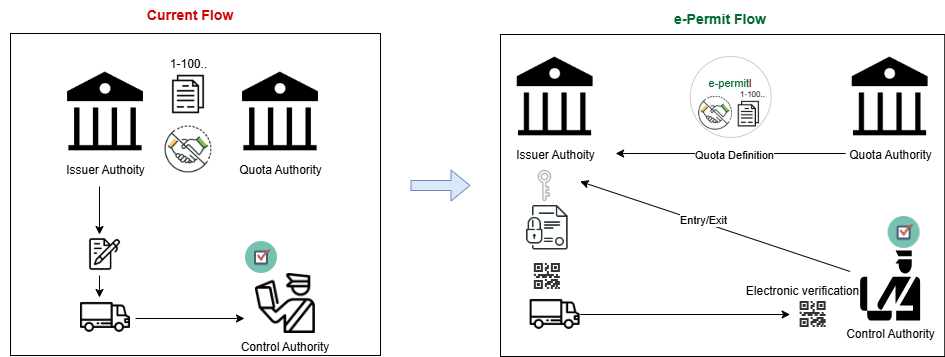

# Electronic Permit

## Introduction

Permit is a document that authorizes the vehicle in a transport operation to cross the border of the destination country. In the current system, this document (permit) is physically prepared/printed by destination country and delivered to the corresponding country in a certain number. Then the haulier country issues a permit credential for vehicle. Difficulties in the implementation of this system and the security issues required the digitalization of the permit.
This draft text represents the arrangement of the specifications about the e-permit (digital permit).

## Problem and Solution

Permit can be considered as a common credential except some of its features. 

- It is exchanged in a certain number (quota) between two countries through protocols.
- The parties that deliver and receive the e-permit are known in advance of the exchange.
- Information about the usage (number of used/unused permits) of the permit is important for the countries (permit quota/usage).



Considering the above-mentioned characteristics; the permit has an authentic format, it is created by the issuing authority and signed for the verifier country in a certian number. In this scenario, e-permit solution should provide the safety conditions such as identity validation, integrity and undeniability. Besides all these, in the event of a connection problem, it ensures offline verification as well. To sum up, the e-permit should have the below features: 

- Decentralized Trust
- Extensible and easy integrate (HTTP)
- Secure(Non Repudiation, Authentication, Integrity)
- Online/Offline Verification
- Fault Tolerance


## Implementation

### Permit Verification

As the e-permit, under normal circumstances,  will be sent to the other party through web service, the verification will be done online as default. However, it can be realised offline in cases of network problems.

#### Online Verification

The information of the newly formed e-permit can be displayed and the e-signature can be verified as the verifier authority enters the single permit identifier.

#### Claims of e-permit credential(through web services)

| Code | Field | Description | Required | Format | Sample Value | 
| ---- | ------| ----------- | -------- | ------ | ------------ | 
| 1 | permit_issuer | This permit issued by |  &#9745; | Country code | UZ |
| 2 | permit_issued_for | This permit issued for | &#9745; | Country code | TR |
| 3 | permit_year | Year of the permit | &#9745; | Year | 2020 |
| 4 | permit_type | Type of the permit | &#9745; | Enum[1,2,3,4,5,6] | "BILITERAL", "TRANSIT", "THIRDCOUNTRY","BILITERAL_FEE", "TRANSIT_FEE", "THIRDCOUNTRY_FEE"  |
| 5 | serial_number | Serial Number of the permit | &#9745; | Number | 1 |
| 6 | permit_identifier | Permit identifier | &#9745; | ISSUER-VERIFIER-YEAR-TYPE-SERIALNUMBER | UZ-TR-2021-1-1 |
| 7 | issued_at | This permit prepared on | &#9745; | dd/MM/yyyy | 01/03/2021 |
| 8 | expire_at |  Permit valid until | &#9745; | dd/MM/yyyy | 31/01/2022 |
| 9 | company_name | Name of the company | &#9745; | Text(max 100) | Sample Org. |
| 10 | company_id | Company identifier |&#9745; | Text | 123 |
| 11 | plate_number | Plate number(s) | &#9745; | Text | 06BB1234 |
| 12 | other_claims | Other claims | | Key Value | {} |

#### Offline Verification

In case of a network problem, the e-permit that is given to the carrier as qr code, can be verified offline by using the “Verifier Application. Countries can either develop their own verifier applications or use the universal verifier web application.( Universal Verifier Application (https://e-permit.github.io/verify)
Format of the permit is created by the addition of version information to the JWS format:
```{version}.{header}.{payload}.{signature}```(version: 0 means demo)

#### Claims of e-permit offline credential

| Code | Field | Description | Required | Format | Sample Value | 
| ---- | ------| ----------- | -------- | ------ | ------------ | 
| 1 | exp |  Permit valid until | &#9745; | dd/MM/yyyy | 31/01/2022 |
| 2 | id | Permit identifier | &#9745; | ISSUER-VERIFIER-YEAR-TYPE-SERIALNUMBER | TR-UZ-2021-1-1 |
| 3 | iat | This permit prepared on | &#9745; | dd/MM/yyyy | 10/01/2021 |
| 4 | cn | Name of the company | | Text(max 100) | Sample Org. |
| 5 | pn | Plate number(s) | &#9745; | Text | 06AA1234 |


### Events

When a country defines a quota, creates / cancels a permit or when a counterpart’s transport operator enters the country, these data will have to be sent to the counterpart. These data are named as “event”. Each country which is integrated electronically should be able to create and send these events to the counterpart and process the events created by the counterpart.  

Each event should contain certain fields. These fields are shown in the following table:

| No | Field | Description | Format | 
| ---- | ------| ----------- | -------- | 
| 1 | event_id |  The unique identifier of event | Text(e.g. ABC123..) |
| 2 | previous_event_id | Previous event identifier | Text(e.g. ABC123..) |
| 3 | event_type | Event type | Enum[KEY_CREATED, KEY_REVOKED, QUOTA_CREATED, PERMIT_USED, PERMIT_CREATED, PERMIT_REVOKED] | 
| 4 | event_timestamp | The UTC time of the event | Long(1625304893) |
| 5 | event_publisher | Event publisher | Two letter country code(e.g. TR, UZ, UA) |
| 6 | event_subscriber | Event subscriber | Two letter country code(e.g. TR, UZ, UA)  |

#### Identity Management

Electronic identity management is needed in order to provide safe and undeniable (with digital signature) electronic communcition between two countries. In such scenarios where the parties are certainly known, the identity management can be performed with the below method easily.
- Each country produces its own key pair.
- Each country keeps the private key safely in its system for signing e-permit
- The public key is sent to the other country for the verification of signature.

#### ```/epermit-configuration``` ```GET```

When a country wants to add another country it uses this resource to retrieve information about the country. 
Sample response:

```
{
      "code": "TR",
      "name": "Turkey",
      "keys": [
        {
          "kty": "EC",
          "crv": "P-256",
          "x": "b-twdhMdnpLQJ_pQx8meWsvevCyD0sufkdgF9nIsX-U",
          "y": "U339OypYc4efK_xKJqnGSgWbLQ--47sCfpu-pJU2620",
          "use": "sig",
          "kid": "1",
          "alg": "ES256"
        }
      ]
 }
```

#### ```/events/key-created``` ```POST```

A country uses this resource when it creates a key. 

| No | Field | Description | Format | 
| ---- | ------| ----------- | -------- | 
| 1 | kid |  Key identifier | Text(e.g. 2) |
| 2 | kty | Key type | P-256 |
| 3 | use | Usage | sig | 
| 4 | crv | Curve | P-256 |
| 5 | x | Public key y value | b-twdhMdnpLQJ_pQx8meWsvevCyD0sufkdgF9nIsX-U |
| 6 | y | Public key x value | U339OypYc4efK_xKJqnGSgWbLQ--47sCfpu-pJU2620 |
| 7 | alg | The jws algorithm | ES256 |

#### ```/events/key-revoked``` ```POST```

A country uses this resource when it revokes a key. 

| No | Field | Description | Format | 
| ---- | ------| ----------- | -------- | 
| 1 | key_id |  Key identifier | Text(e.g. 2) |
| 2 | revoked_at | The UTC time of revocation | Long(123444) |

### Quota Management

A country, should define serial number quotas in certain intervals for counterpart’s transport operators. This process is defined as quota description. By this way counterpart can produce permits for its own hauliers in the defined quota interval. This event contains the following fields.

#### ```/events/quota-created``` ```POST```

A country uses this resource when it creates a permit. 

| No | Field | Description | Format | 
| ---- | ------| ----------- | -------- | 
| 1 | permit_issuer | Permit issuer for the quota | UZ |
| 1 | permit_issued_for | Permit issued_for for the quota | TR |
| 1 | permit_year |  Year of the quota | 2021 |
| 2 | permit_type | Permit type of the quota | BILITERAL |
| 3 | start_number | Start number of the quota | 20 |
| 4 | end_number | End number of the quota | 50 |

### Permit Management

#### ```/events/permit-created``` ```POST```

A country uses this resource when it creates a permit. 

| No | Field | Description | Format | 
| ---- | ------| ----------- | -------- | 
| 1 | permit_id |  Permit identifier | TR-UZ-2021-1-1 |
| 1 | permit_issuer | Permit issuer for the quota | UZ |
| 1 | permit_issued_for | Permit issued_for for the quota | TR |
| 2 | permit_year |  Year of the quota | 2021 |
| 3 | permit_type | Permit type | BILITERAL |
| 4 | serial_number |  Serial number of permit | 1 |
| 5 | issued_at |  This permit prepared on | 03/03/2021 |
| 6 | expire_at |  Permit valid until | 31/01/2022 |
| 7 | company_name |  Year of the quota | ABC Company |
| 8 | company_id |  Company identifier | 123 |
| 9 | plate_number |  Plate Number(s) | 06TEST1234 |
| 10 | other_claims |  Optional Data | ```{"res": "The permit is restricted..."}``` |

#### ```/events/permit-revoked``` ```POST```

A country uses this resource when it creates a permit. 

| No | Field | Description | Format | 
| ---- | ------| ----------- | -------- | 
| 1 | permit_id |  Permit identifier | TR-UZ-2021-1-1 |

#### ```/events/permit-used``` ```POST```

A country uses this resource when it creates a permit.


| No | Field | Description | Format | 
| ---- | ------| ----------- | -------- | 
| 1 | permit_id |  Permit identifier | TR-UZ-2021-1-1 |
| 2 | activity_type |  Usage type | ENTERANCE-EXIT |
| 3 | activity_timestamp | The UTC time of the activity  | Long |
| 4 | activity_details |  Activity details(optional) | Text(max 1000) |


## Rest API Resources

When an event message has occured in a party(country):

- Event payload is created
- Payload is signed with private key of the party
- Then signed event is sended through web service as authorization header to verifier country

The sended event can be considered as a standard JWS like below:


Each country should implement below rest api resources to communicate with other countries


### ```/epermit-configuration``` ```GET```

When a country wants to add another country it uses this resource to retrieve information about the country. 
Sample response:

```
{
      "code": "TR",
      "name": "Turkey",
      "keys": [
        {
          "kty": "EC",
          "crv": "P-256",
          "x": "b-twdhMdnpLQJ_pQx8meWsvevCyD0sufkdgF9nIsX-U",
          "y": "U339OypYc4efK_xKJqnGSgWbLQ--47sCfpu-pJU2620",
          "use": "sig",
          "kid": "1",
          "alg": "ES256"
        }
      ]
 }
```
