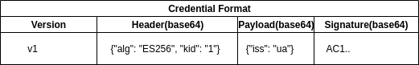

# Electronic Permit System

## Legacy Permit Flow


## New e-Permit Flow


## Implementation

### Managing Digital Keys

> Each party should manage own configuration about other parties

**Authority Config Sample**

```https://e-permit.gov.<country code>/config.json```

```json
{
    "id": "ua",
    "title": "Ukraine",
    "authorities": [
      {
        "id": "tr",
        "title": "Republic Of Turkey",
        "keys": [
          {
            "kty": "EC",
            "use": "sig",
            "kid": "1",
            "crv": "P-256",
            "x": "kKUBDGuy-smxA6omYlXBotSzPVB6qKI2jRe1x9U4_kE",
            "y": "5q8JKBbFoiNuDDibs7h5zIohNvDiG70UJKq4E4n51Kg",
            "alg": "ES256"
          }
        ]
      }
    ]
  }
```

### Issuing Credential

### Verifying Credential


### Fields
| Field Code | Description | Required | Field Format | Value | 
| ----------- | ----------- | -------- | ------- | ------- | 
| sub | Vehicle registration plate | &#9745; |  [*identifier*] | 06BB2020 |
| iss | Issuing Authority |  &#9745; | Country code | ua |
| aud | Verifier Authority | &#9745; | Country code | tr |
| exp |  Date of expiry | &#9745; | Unix Epoch Time | 1311281970 |
| iat | Date of issuance | &#9745; | Unix Epoch Time | 1311281970 |
| cid | Credential Identifier | &#9745; | Sequential number | 1 |
| cy | Year of issuance | &#9745; | year | 2020 |
| ct | Credential Type | &#9745; | enum[1,2,3] | "biliteral", "transit", "3rd" |
| oid | Organization Identifier | &#9745; | Unique organization identifier | A101.. | 
| on | Organization Name | | Free Text(max 100) | Sample Org. |
| res | Restrictions | | Free Text(max 100) | Sample res. |


### QR Code with JWS(ES256) Content




### Rest Api

- ```/credentials```: post a credential into verifier database(self contained auth) 
- ```/credentials/{id}```: get a credential info and status by hash value 
- ```/credentials/{id}/used```: change credential status by verifier officer(auth required)

> **id** is credential hash

## Demo

- [Issuer Demo]( https://e-permit.github.io/demo/)
- [Verifier Demo(camera is required)]( https://e-permit.github.io/verify/)


