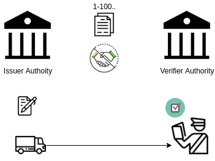
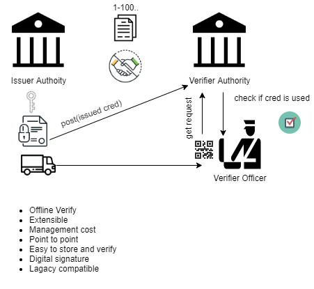
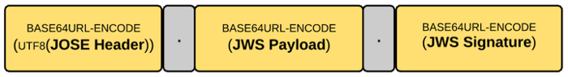

# Electronic Permit

## Legacy Permit Flow



## New e-Permit Flow



## Implementation

### Managing Digital Keys

- Issuer generates a key pair(private and public)
- Issuer saves your private key securily on its own storage
- Issuer sends public key to verifier authority
- Verifier saves public key. 

### Issuing Credential

- Issuing authority signs credential payload with own private key
- Issuing authority sends credential information to verifier authority via rest api(```/credentials```) post call
- Issuing authority generates a qr code with credential info and sends it to driver 

### Verification of credential

Verification of credential can be via Open Source Verification Application or Internal Application. There are two verification methods.

#### Online Verification

This is default verification method. Flow is like below:

- Verifier officer types credential identifier by using *universal verifier app* or *private app*
- App makes an api call to get credential claims and status info(```/credentials/{credId}```).
- App shows credential details.
- Verifier can make an api call to change credential status 

#### Offline Verification

If there is network or server problem, verifier officer can use offline verification with scanning qr code and signature verification. This is a fallback mechanism. There is a drawback for the verification. Verifier can't know the current status of credential.

#### Universal Verification Application

If verifier wants to enable open source verifier app, should expose a config.json:   

```https://e-permit.gov.<country code>/config.json```

```json
{
    "id": "ua",
    "authorities": [
      {
        "id": "tr",
        "keys": [
          {
            "kty": "EC",
            "use": "sig",
            "kid": "1",
            "crv": "P-256",
            "x": "kKUBDGuy-smxA6omYlXBotSzPVB6qKI2jRe1x9U4_kE",
            "y": "5q8JKBbFoiNuDDibs7h5zIohNvDiG70UJKq4E4n51Kg",
            "alg": "ES256"
          }
        ]
      }
    ]
  }
```

## Fields

| Code | Field | Description | Required | Format | Sample Value | 
| ---- | ------| ----------- | -------- | ------ | ------------ | 
| 1 | cy | Year of the permit | &#9745; | Year | 2020 |
| 2 | exp |  Permit valid until | &#9745; | Unix Epoch Time | 1311281970 |
| 3 | cid | Serial Number of the permit | &#9745; | Number | 1 |
| 4 | iss | This permit issued by |  &#9745; | Country code | ua |
| 5 | iat | This permit prepared on | &#9745; | Unix Epoch Time | 1311281970 |
| 6 | comn | Name of the company | | Text(max 100) | Sample Org. |
| 7 | comid | National ID of the company | &#9745; | Text | A101.. | 
| 8 | sub | Plate number(s) | &#9745; | Text | 06BB2020 |
| 9 | ct | Type of the permit | &#9745; | Enum[1,2,3] | "biliteral", "transit", "3rdcountry" |
| 10 | res | Restrictions | | Text(max 100) | Sample res. |
| 11 | aud | This permit issued for | &#9745; | Country code | tr |


## Credential Details 

Permit credential is a jws with permit claims. Classic jws format is like below:



Permit credential is like jws but adding extra version information as prefix:

```{version}.{header}.{payload}.{signature}```

For version 1 only ```ES256``` algorithm is supported.


## Verifier Rest Apis

- ```/credentials```: post a credential into verifier database by issuer(self contained auth) 
- ```/credentials/{id}```: get a credential info and status by hash value 
- ```/credentials/{id}/revoke```: revoke credential by issuer(with a jwt token generated by issuer)
- ```/credentials/{id}/used```: change credential status by verifier officer(auth required)

> **id** is credential hash

## Demo

- [Issuer Demo]( https://e-permit.github.io/demo/)
- [Universal Verifier Application(camera is required)]( https://e-permit.github.io/verify/)


