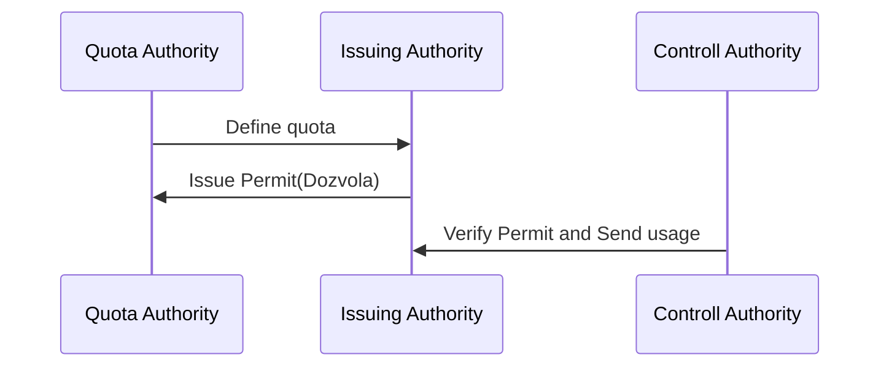

# Electronic Permit(Dozvola)

## Introduction

Dozvola(Permit) is a document that authorizes the vehicle in a transport operation to cross the border of the verifier country. In the current system, this document (dozvola) is physically prepared/printed by verifier country and delivered to the issuer(haulier) country in a certain number. Then the issuer(haulier) country issues a permit credential for vehicle. Difficulties in the implementation of this system and the security issues required the digitalization of the permit.

This text represents the arrangement of the specifications about the e-permit (digital permit).

## Problem

Permit can be considered as a verifiable credential except some of its features. 

- It is exchanged in a certain number (quota) between two countries through protocols.
- The parties that deliver and receive the e-permit are known in advance of the exchange.
- Information about the usage (enter/exit permits) of the permit is important for the countries (permit quota/usage).

Considering the above-mentioned characteristics; the permit has an authentic format, it is created by the issuing authority and sealed for the quota authority. According to this standard, each authority must provide its own e-seal to sign digital message and permits with its own private key.


## Concepts

### Authority

The authority is defined as a country or organization that issues permits, quotas or verifies the permits. If the authority is a country, the authority code is the two letter country code. If the authority is an organization, the authority code is the unique identifier of the organization. For example, TR, UZ, UA, BSEC etc. Each authority has its own e-seal to sign the data.

### Quota Authority(Issued For)

The quota authority(country or organization) that defines the dozvola(permit) quota for the issuing authority. In general it is the same with control authority however in some cases it can be an organization e.g. BSEC, TRACECA.

### Issuing Authority(Issuer)

The authority that is responsible for issuing dozvola(permit) for its hauliers. It should be only a country.

### Control Authority

The authority that is responsible for verify the dozvola. It should be only a country. 

## Flow



## Entities

### Quota

An authority should define serial number quotas in certain intervals for haulier's transport authority. This process is defined as quota description. By this way the authority can produce permits for its own hauliers in the defined quota interval. An authority should define the quota for the haulier in the following table:

| No | Field | Description | Example | 
| ---- | ------| ----------- | -------- |
| 1 | permit_year |  Year of the quota | 2025 |
| 2 | permit_type | Quota type of the quota | 1 |
| 3 | quantity | Quantity of the quota | 20 |

### Permit Types

| CODE | NAME |  
| ---- | ------|
| 1 | Bilateral |
| 2 | Transit |
| 3 | Third Country |
| 4 | Unladen entry/return load |

### Permit ID

The permit id is the combination of permit year, permit type, permit issuer and permit issued for.

<br />

<div class="timeline">
    <div class="event">
      <span class="code">TR</span>
      <div class="label">Issuer authority</div>
    </div>
    <div class="event">
      <span class="code">UZ</span>
      <div class="label">Quota authority</div>
    </div>
    <div class="event">
      <span class="code">2025</span>
      <div class="label">Year of the permit</div>
    </div>
    <div class="event">
      <span class="code">1</span>
      <div class="label">Type of the permit (BILATERAL)</div>
    </div>
    <div class="event">
      <span class="code">1</span>
      <div class="label">Sequence number</div>
    </div>
  </div>

### Permit

| | Field Code | Description | Example | 
| ---- | ------| ----------- | -------- | 
| (1) | permit_id |  PERMIT SERIAL NUMBER | TR-UZ-2021-1-1 |
| (2) | permit_type | TYPE OF THE PERMIT | 1 (BILATERAL) |
| (3) | permit_year |  YEAR OF THE PERMIT | 2025 |
| (4) | permit_issuer | PERMIT ISSUED BY | TR |
| (5) | permit_issued_for | PERMIT ISSUED FOR | UZ |
| (6) | plate_number |  PLATE NUMBER(S) | 06TEST1234 |
| (7) | plate_number2 |  PLATE NUMBER(S) | 06TEST1234 |
| (8) | issued_at |  PERMIT PREPARED ON | 03/03/2021 |
| (9) | expires_at |  PERMIT VALID UNTIL | 31/01/2025 |
| (10) | company_name |  NAME OF THE COMPANY | e.g. ABC Company |
| (11) | company_id |  ID OF THE COMPANY | e.g. 123 |
| (12) | departure_country |  DEPARTURE COUNTRY | e.g. TR |
| (13) | arrival_country |   ARRIVAL COUNTRY | e.g. UZ |
| (14) | other_claims |  OTHER INFORMATION/RESTRICTIONS | ```{"res": "The permit is restricted..."}``` |

### Usage(Entry/Exit)

| No | Field | Description | Example | 
| ---- | ------| ----------- | -------- | 
| 2 | activity_type |  Usage type | ENTERANCE-EXIT |
| 3 | activity_timestamp | The UTC time of the activity  | 1746172534 |
| 4 | activity_details |  Activity details(optional) | A Border |

<style>
    .timeline {
      display: flex;
      justify-content: left;
      align-items: center;
      margin: 3em 0;
      gap: 2em;
    }
    .event {
      position: relative;
      text-align: center;
      /* base color for box, arrow, and label */
    }
    /* assign each event its color */
    .event:nth-child(1) { color: #e74c3c; }    /* red */
    .event:nth-child(2) { color: #3498db; }    /* blue */
    .event:nth-child(3) { color: #2ecc71; }    /* green */
    .event:nth-child(4) { color: #f1c40f; }    /* yellow */
    .event:nth-child(5) { color: #9b59b6; }    /* purple */

    /* dash separators */
    .event:not(:last-child)::after {
      content: "–";
      position: absolute;
      right: -1em;
      top: 50%;
      transform: translateY(-50%);
      font-size: 1.2em;
      color: #333;
    }

    /* the box */
    .event .code {
      display: inline-block;
      position: relative;
      font-weight: bold;
      font-size: 1.2em;
      padding: 0.5em 2em;
      border: 2px solid currentColor;
      border-radius: 6px;
      color: currentColor;
    }

    /* odd items: arrow up+head pointing down toward box */
    .event:nth-child(odd) .code::before {
      content: "";
      position: absolute;
      left: 50%;
      bottom: 100%;
      transform: translateX(-50%);
      width: 2px;
      height: 0.8em;
      background: currentColor;
    }
    .event:nth-child(odd) .code::after {
      content: "";
      position: absolute;
      left: 50%;
      bottom: calc(100% + 0.8em);
      transform: translateX(-50%);
      border-left: 6px solid transparent;
      border-right: 6px solid transparent;
      border-bottom: 6px solid currentColor;
    }

    /* even items: arrow down+head pointing up toward box */
    .event:nth-child(even) .code::before {
      content: "";
      position: absolute;
      left: 50%;
      top: 100%;
      transform: translateX(-50%);
      width: 2px;
      height: 0.8em;
      background: currentColor;
    }
    .event:nth-child(even) .code::after {
      content: "";
      position: absolute;
      left: 50%;
      top: calc(100% + 0.8em);
      transform: translateX(-50%);
      border-left: 6px solid transparent;
      border-right: 6px solid transparent;
      border-top: 6px solid currentColor;
    }

    /* labels use the same currentColor */
    .event .label {
      position: absolute;
      white-space: nowrap;
      font-size: 1.0em;
      color: gray
    }
    .event:nth-child(odd) .label {
      bottom: 100%;
      transform: translateY(-2em);
    }
    .event:nth-child(even) .label {
      top: 100%;
      transform: translateY(2em);
    }
  </style>

  <script type="module">
    import mermaid from 'https://cdn.jsdelivr.net/npm/mermaid@11/dist/mermaid.esm.min.mjs';
    mermaid.initialize({startOnLoad:true,theme:'neutral'})
    await mermaid.run({querySelector:'code.language-mermaid'})
</script>