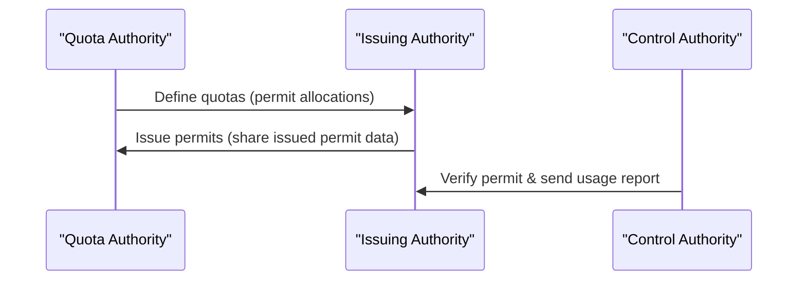

# Electronic Permit (Dozvola) System – Technical Specification

## Introduction

A **Permit** (called *Dozvola* in some contexts) is a document that authorizes a vehicle to cross the border of another country as part of an international transport operation. In the traditional paper‐based process, the quota authority printed the permits and shipped them in limited quantities to the partner (issuing) country, which distributed them to its hauliers. The issuing country would then distribute these paper permits to its trucking companies for use. This manual process has various drawbacks, including logistical difficulties and security vulnerabilities, which have driven the transition to a digital e-permit system.

A permit can be viewed similarly to a *verifiable credential* (a digitally signed, verifiable document), but it has some unique characteristics:

* **Quota-Based:** Permits are exchanged in limited quantities (**quotas**) between two specific authorities (usually countries) based on bilateral or multilateral agreements.
* **Known Parties:** The parties involved in issuing and verifying the permit are known in advance, unlike open credentials that any party might verify.
* **Usage Tracking:** Recording the usage of the permit (each border entry and exit using that permit) is crucial for both the issuing and control authorities.

Thus, in the system, each permit follows a structured lifecycle. It is **defined** by the quota authority, then **issued** by the issuing authority, and finally **verified** by the control authority at the border.

Because each country has its own internal processes for managing permits, it is neither feasible nor necessary to standardize every internal detail. Instead, this specification focuses on the **common data exchange** and format between authorities. It defines how e-permit information is structured and shared so that different national systems can interoperate seamlessly. The goal is to provide a clear specification for government agencies, technical personnel and developers implementing the e-permit core system.

## Key Concepts and Roles

### Authority

In the context of e-permits, an **Authority** refers to a governing entity that can issue permits, define quotas, or verify permits at borders. An authority is usually a country, but it can also be an international organization involved in transport agreements. Each authority is identified by a unique code:

* If the authority is a country, the code is the two-letter country code (e.g., `TR` for Turkey, `UZ` for Uzbekistan, `UA` for Ukraine).
* If the authority is an organization, the code is a distinct abbreviation or identifier (e.g., `BSEC` for the Organization of the Black Sea Economic Cooperation, `TRACECA` for a specific transport corridor agreement).

Every authority possesses its own electronic seal (digital signature key/certificate) used to sign data (such as permits or quotas) to ensure authenticity and integrity of the information exchanged.

### Issuing Authority

The **Issuing Authority** is the authority (country) responsible for issuing permits to its hauliers (domestic transport companies). The issuing authority receives a certain quota of permits from a partner (quota) authority and then creates the individual electronic permits for use by vehicles registered in its country. Only a country can be an issuing authority in this system (organizations do not issue permits to vehicles directly).

*Example:* If Turkey (`TR`) and Uzbekistan (`UZ`) have a bilateral permit agreement, Turkey’s Ministry of Transport would act as the issuing authority that issues permits (dozvolas) to Turkish trucking companies for trips to or through Uzbekistan.

### Quota Authority

The **Quota Authority** (also called the *issued-for* authority) is the entity that defines how many permits can be issued by the partner country. In most cases, the quota authority is the same country that will control the permit at its borders (i.e. the country where the permit is used). For instance, if Uzbekistan is allowing Turkish trucks to enter its territory, Uzbekistan acts as the quota authority by setting the number of permits Turkey may issue for Uzbek-bound transport.

In some scenarios, the quota authority might be an international organization coordinating permit quotas for multiple countries. In such cases, the organization (e.g., **BSEC** or **TRACECA**) sets the quota, although the actual control of permits at the border is still performed by the individual countries. Generally, however, the quota authority corresponds to the country where the permit will be used.

### Control Authority

The **Control Authority** is the country responsible for verifying and enforcing the permit at the border crossing. When a vehicle arrives at the border, the control authority’s officers check the e-permit’s validity (including inspecting the digital signature and the details). The control authority is almost always the same as the quota authority (the country that the vehicle is entering or transiting), except in cases where an organization plays the quota role. Only a country can perform the control function, since organizations do not have physical borders to control.

After verification, the control authority records the usage of the permit (for example, noting that the permit was used for an entry or exit at a certain time) and typically communicates that usage back to the issuing authority for accountability and quota tracking.

### Quota

A **Quota** is an agreed-upon quantity of permits of a certain type that an issuing authority is allowed to issue, usually within a specific time frame (often per year). Quotas are established by the quota authority and communicated to the issuing authority. This process of defining permit allowances is known as the *quota description*.

By defining a quota, the quota authority grants the issuing authority a range of permit serial numbers or a total number of permits that can be issued. The issuing authority must ensure it does not issue more permits than the quantity allocated. Quotas are typically defined per year and per permit type.

For example, Uzbekistan (as quota authority) might grant Turkey (issuing authority) a quota of 20 bilateral permits for the year 2025. This means Turkey can issue up to 20 permits of type "Bilateral" in 2025 for use in Uzbekistan.

Key fields in a quota definition include:

| No | Field            | Description                                                                | Example |
| -- | ---------------- | -------------------------------------------------------------------------- | ------- |
| 1  | **permit_issuer** |    Permit Issuing Authority                                               | TR    |
| 1  | **permit_issued_for** | Permit Quota Authority                                                | UZ    |
| 1  | **permit_year** | Year that the quota applies to                                              | 2025    |
| 2  | **permit_type** | Type/category of permit for this quota (see [Permit Types](#permit-types))  | 1       |
| 3  | **quantity**     | Number of permits of that type allocated for that year                     | 20      |

*Note:* In practice, a quota definition would also be associated with the specific issuing authority and quota authority (e.g., “UZ grants TR 20 permits of type 1 for 2025”). This context is typically understood from the communication channel or documentation of the bilateral agreement.

### Permit Types

Permits come in different categories, which affect how they can be used. The system defines a code for each permit type. The common permit types and their codes are:

| Code | Name                      |
| ---- | ------------------------- |
| 1    | Bilateral                 |
| 2    | Transit                   |
| 3    | Third Country             |
| 4    | Unladen Entry/Return Load |

**Permit Type Descriptions:**

* **Bilateral** – A permit for transport operations directly between the two partner countries (the issuing country and the quota/control country). For example, a Turkish truck carrying goods to Uzbekistan would use a bilateral permit.
* **Transit** – A permit for transit operations through the quota/control country to a third destination. For example, a Turkish truck transiting through Uzbekistan to reach another country would use a transit permit (if such transit is allowed under their agreement).
* **Third Country** – A permit that allows a haulier from the issuing country to carry goods between the quota country and a third country (neither the issuing nor the quota country is the origin/destination of the cargo). This is typically a special case permit in bilateral agreements.
* **Unladen Entry/Return Load** – A permit allowing a vehicle to enter the quota country empty (without cargo) in order to pick up a return load (cargo) from that country back to the issuing country. This covers scenarios where a truck goes to the partner country solely to bring goods back home.

### Permit ID

Each permit is identified by a unique **Permit ID** (serial number). The permit ID is a composite code that typically consists of:

 
 

    

      TR
      
Issuer authority

    

    

      UZ
      
Quota authority

    

    

      2025
      
Year of the permit

    

    

      1
      
Type of the permit (BILATERAL)

    

    

      1
      
Sequence number

    

 
 

* The issuing authority’s code (the country code of the issuer).
* The issued-for authority’s code (the country or organization code for which the permit is valid – essentially the quota/control side).
* The permit year.
* The permit type code.
* A sequence number (a serial number for that permit within the year/type category).

These components are usually concatenated with dashes. This structured ID ensures that every permit can be uniquely distinguished across countries and years.

For example, consider the permit ID **`TR-UZ-2025-1-1`**:

* **TR** – Issuing country code (Turkey).
* **UZ** – Issued-for (Quota) country code (Uzbekistan).
* **2025** – Permit year (year of validity/quota).
* **1** – Permit type code (1 corresponds to "Bilateral").
* **1** – Sequence number of the permit (this is the first permit issued by TR for UZ in that year and type category).

In this example, `TR-UZ-2025-1-1` denotes Turkey’s first bilateral permit for 2025 that is valid for Uzbekistan. The sequence number would increment for each additional permit issued (e.g., `TR-UZ-2025-1-2` for the second permit, and so on) up to the quota limit. The combination of issuer, issued-for, year, type, and sequence makes the permit ID unique and easy to parse.

## Permit Data Structure

An **e-Permit** (electronic permit) is represented by a set of data fields containing all relevant information about that permit. The data model for a permit is outlined below:

| No   | Field                   | Description                                                                                                                                  | Example                                                   |
| ---- | ----------------------- | -------------------------------------------------------------------------------------------------------------------------------------------- | --------------------------------------------------------- |
| (1)  | **permit_id**          | Unique permit ID (serial number), as defined above.                                                                                          | `TR-UZ-2025-1-1`                                          |
| (2)  | **permit_type**        | Type of the permit (using the code from [Permit Types](#permit-types)).                                                                      | 1 (Bilateral)                                             |
| (3)  | **permit_year**        | Year of the permit (typically the year of validity or quota allocation).                                                                     | 2025                                                      |
| (4)  | **permit_issuer**      | Issuing authority code (the country that issued the permit).                                                                                 | `TR`                                                      |
| (5)  | **permit_issued_for** | Issued-for authority code (the country or organization for which this permit is valid – essentially the quota/control side).                 | `UZ`                                                      |
| (6)  | **plate_number**       | Vehicle license plate number (primary plate, e.g. the truck’s registration).                                                                 | `06ABC1234`                                               |
| (7)  | **plate_number2**      | Secondary vehicle plate number (e.g. trailer registration, if applicable).                                                                   | `06XYZ5678`                                               |
| (8)  | **issued_at**          | Date when the permit was issued/prepared.                                                                                                    | 03/03/2025                                                |
| (9)  | **expires_at**         | Date when the permit expires (last valid date for use).                                                                                      | 31/12/2025                                                |
| (10) | **company_name**       | Name of the haulier company to which the permit is issued.                                                                                   | ABC Transport Ltd.                                        |
| (11) | **company_id**         | ID or registration number of that company.                                                                                                   | 123                                                       |
| (12) | **departure_country**  | Country of departure for the trip in which this permit will be used (origin of journey).                                                     | `TR`                                                      |
| (13) | **arrival_country**    | Country of arrival/destination for the trip (destination of journey).                                                                        | `UZ`                                                      |
| (14) | **other_claims**       | Any other information or restrictions, in a structured format (e.g. JSON). This can include special conditions, route limitations, or notes. | `{"res": "Permit not valid for third-country transport"}` |

**Notes:**

* The **permit\_id** field is the primary identifier that links a permit to its usage records and to the quota. It encodes the permit’s issuer, target (issued-for authority), year, type, and serial number.
* **Plate numbers:** Many permits require specifying the vehicle’s registration number(s). The primary plate (usually the truck’s tractor unit) is given in `plate_number`. A second plate (`plate_number2`) is provided for cases where a trailer’s plate or an additional vehicle’s plate needs to be recorded. If only one plate number is applicable, the second field may be left blank or omitted as per the system’s requirements.
* **Company information:** `company_name` and `company_id` refer to the transport company (haulier) that is using the permit. The company ID could be a national registration number, tax ID, or another identifier for the company in the issuing country’s system.
* **Departure/Arrival country:** These fields indicate the intended route for using the permit. For a bilateral permit, the departure country is typically the issuing country and the arrival country is the quota/control country. For a transit permit, these might represent the overall origin and final destination of the journey (which could be outside the quota country). This information helps authorities understand how the permit is being used (e.g., a transit permit might list a third country as the final destination).
* **Other claims:** This field can store additional JSON-structured data about the permit. It might include restrictions or special conditions that do not fit into the standard fields. For example, it could specify that the permit is only valid during certain months, or not valid for carrying certain types of goods. The content and keys of this JSON object can be agreed upon by the authorities involved (in the example above, `"res"` might stand for a restriction note).

## Permit Usage and Activity Records

When a permit is utilized at a border crossing, the event needs to be recorded. This is represented as a **Permit Activity** (or **permit usage record**). A permit activity record captures information about a border crossing event (entry or exit) involving a specific permit. Typically, each time the vehicle uses the permit to either enter or exit the quota country, a record is generated.

The data fields for a permit activity are as follows:

| No  | Field                   | Description                                                                                                        | Example                  |
| --- | ----------------------- | ------------------------------------------------------------------------------------------------------------------ | ------------------------ |
| (1) | **permit_id**           | The permit that has activity.                                                                                      | TR-UZ-2025-1-1           |
| (2) | **activity_type**       | Type of usage event. For example, `"ENTRY"` or `"EXIT"`.                                                           | ENTRY                    |
| (3) | **activity_timestamp**  | Date/time of the event in UTC, typically recorded as a Unix timestamp (seconds since Jan 1, 1970).                 | 1746172534               |
| (4) | **activity_details**    | Additional details about the event (optional). This could be the name of the border crossing or any relevant note. | "Alat border checkpoint" |

**Notes:**

* The **activity\_type** will usually be either an entry or an exit event. In many cases, a permit will have two corresponding records: one when the vehicle enters the country (ENTRY) and one when it exits (EXIT). This allows tracking of a complete round trip and ensures the permit was used as intended. If a permit is only valid for a single entry (with no exit, for instance in one-way transit scenarios), at minimum an entry record would be created when the permit is first used.
* The **activity\_timestamp** should be recorded in a consistent format. The example shows a Unix timestamp (in seconds) for simplicity. Using UTC time is important for consistency across time zones.
* **Activity details:** This field can capture context such as the name or code of the border crossing point, direction of travel, or any comments by the border officer. For example, it might contain a checkpoint name like "Alat border checkpoint" or a short code for the border station. It can also be used for notes such as "Vehicle entered with empty load" if needed.

*(The timestamps above are example values in Unix time. 1746057600 corresponds to May 1, 2025 00:00:00 UTC, and 1746403200 corresponds to May 5, 2025 00:00:00 UTC. In practice, the timestamp would reflect the actual time of crossing.)*

In this example, the "ENTRY" record indicates the truck entered on that date via Alat, and the "EXIT" record shows it left a few days later via the same checkpoint. 

These records would be transmitted back to the issuing authority (Turkey) to inform them that the permit was used for an entry and an exit. Once recorded, an activity (ENTRY or EXIT) cannot be revoked. 

> **⚠️ Note: The e-permit core system does not enforce how many times a permit may be used(entry/exit). Each control authority should implement its own rules to check. For example a bilateral permit is limited to two events—one ENTRY and one EXIT—but that rule lives in the border-control logic, not in the core spec.**

## System Workflow

The e-permit system involves several steps and the coordination of multiple authorities, from defining permit quotas to using a permit at the border and reporting its usage. Below is an overview of the typical workflow among the Quota Authority, Issuing Authority, and Control Authority:

1. **Quota Definition:** The quota authority defines the permit quotas and allocations for the issuing authority. For example, a country (or organization) acting as quota authority communicates how many permits of each type for a given year the issuing country may issue. This information is agreed upon and shared ahead of time, usually through diplomatic channels or a formal agreement (in a digital system, this could be via an electronic message or API call containing the quota details).
2. **Permit Issuance:** The issuing authority creates electronic permits for its hauliers based on the received quota. Each permit is assigned a unique permit ID and is associated with specific vehicle plates and a company. The issuing authority may also share the details of issued permits with the quota authority or control authority (especially if the quota authority is an international organization or if required by the bilateral agreement) so that the verifying side is aware of valid permit IDs and details. In a digital system, this could be done by sending the permit data electronically to the partner system or by registering the permits in a shared database that the control side can access.
3. **Border Verification and Usage Reporting:** When a truck reaches the border of the control authority’s country, the driver presents the e-permit (for example, as a digital QR code or a printout that can be scanned). The control authority verifies the permit’s authenticity (checking the digital signature and ensuring the permit ID is valid and has not been used beyond its allowance). If the permit is valid, the vehicle is allowed to enter. The control authority then records a usage event (an entry record) for that permit. When the vehicle later exits, the permit is checked again (to ensure it’s the same permit or that the permit is still valid for exit) and an exit event is recorded. These usage records are then sent back to the issuing authority. By receiving the usage information, the issuing authority knows that the permit was used and can update its records (for example, marking that permit as consumed and decrementing the remaining available quota count if tracking usage against the quota).

This process ensures that all parties have a synchronized understanding of how permits are allocated, issued, and consumed. The quota authority controls the overall number of permits, the issuing authority distributes and manages those permits, and the control authority enforces their proper use and reports back on their consumption.

To illustrate the interactions between the authorities, consider the following sequence diagram:

By following this specification and the above guidelines, agencies can implement systems that **seamlessly integrate** with their counterparts in other countries. The end result will be a more efficient permit issuance and verification process, reduced opportunities for fraud (thanks to digital signatures and real-time data exchange), and improved data sharing between transport authorities for oversight and planning purposes. The e-permit system modernizes cross-border transport permit management and provides a clear framework for both specification and integration.

  
  
